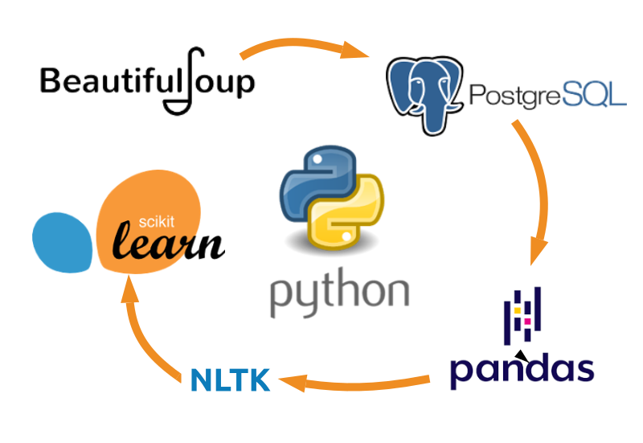
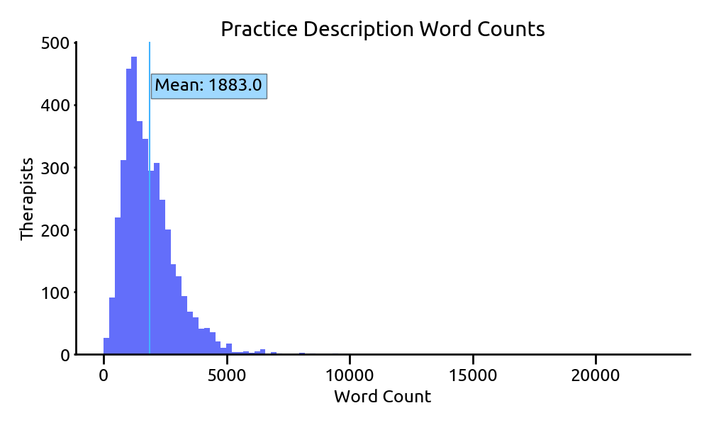
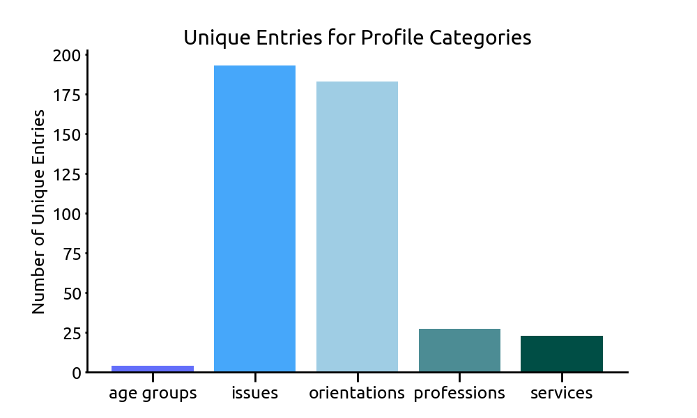
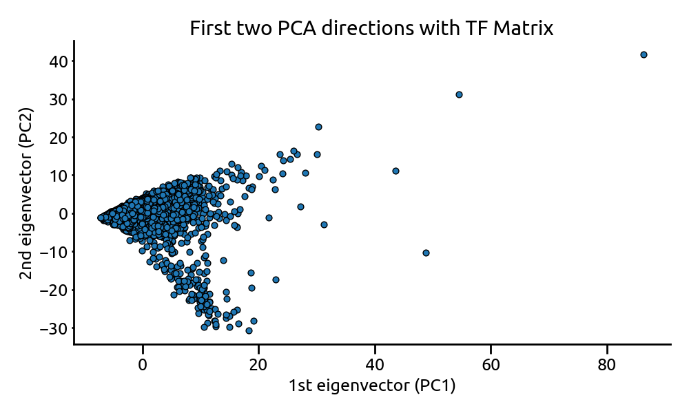

# NLP Analysis of Therapists' Profile Writing

## The Problem: 

People often are confused about how to choose a therapist. The best resource for a recommendation tends to be from a trusted family or friend. However, that is often not available or the person doesn't feel comfortable letting others know they are seeking therapy. So where to go? 

The most popular place is probably an on-line therapist directory such as those found at PsychologyToday.com and GoodTherapy.com.  **Searching for a therapist in a directory can be overwhelming as there are a lot of terms and jargon a person will encounter.**  Raise your hand if you know what Dialectical Behavioral Therapy is and if it would help you.

Plus there are so many options. According to the United States Department of Labor's Bureau of Labor Statistics, there are over **552,000 mental health professionals** practicing in the U.S. today whose main focus is the treatment (and/or diagnosis) of mental health or substance abuse concerns.

In **Denver**, there are **1,912 therapists** listed on PsychologyToday.com's therapist directory

### The Ultimate Goal: 

Create a machine learning model that matches a client to a therapist based on NLP analysis of a writing sample from each party.

### Capstone 2 Goals:

- Create a dataset of therapist writing samples from therapist profiles found from publicly available data on GoodTherapy.com

- Perform **topic modeling on writing samples** of Greater Denver Area therapists to see what themes cluster therapists together base on what words they use to describe their practice.

- A key part of the training and education of therapists is learning the different **theoretical orientations** that are the bedrock of psychotherapy. "*A theoretical orientation is a counselor’s philosophy about how problems develop and how these are resolved or treated. It also informs the  counselor’s focus in each counseling session, goals of counseling, and  interventions you will experience in counseling sessions.*" A theoretical orientation is different than a type of therapy in that it can be seen as the parent class to the type of therapy. I hope to explore how the topics generated align with the traditional orientations.

  - The classic theoretical orientations are:
    - Psychoanalytic/Psychodymanic
    - Cognitive/Cognitive-Behavioral
    - Family Systems
    - Humanistic/Existential
    - Eclectic
  - **My theory is that since a therapists theoretical orientation informs the basics of their therapy, their primary orientation will be reflected in their writing.** 
    - **Capstone 3** this the case,  if we were to also analyze a client's writing (e.g. a journal entry) and run it through the model and find which orientation their writing weights on, might this be a good help fit a therapist to a potential client.

  

## The Data

I obtained profile data for **273** therapists in the Denver Metro Area from **GoodTherapy.com**. 

### Sample Profile

### Data Fields

Almost all of the data is categorical, many of which were lists.

The primary field for analysis is **writing_sample**, which is main body of text in the profile.

| field                        | data-type | sample entries                                               |
| ---------------------------- | --------- | ------------------------------------------------------------ |
| name                         | string    | Peter                                                        |
| address                      | string    | Venkman                                                      |
| phone                        | string    | 212.555.1234                                                 |
| license status               | string    | Active                                                       |
| primary_credential           | string    | Clinical Psychologist                                        |
| website                      | string    | www.mytherapypractice.com                                    |
| therapy_types **(list)**     | strings   | Acceptance and Commitment Therapy (ACT), Attachment-Based Family Therapy (ABFT), Body-Mind Psychotherapy, Existential Psychotherapy, Eye Movement Desensitization and Reprocessing Therapy (EMDR), Holistic Psychotherapy, Mindfulness-Based Interventions |
| issues_treated **(list)**    | strings   | Codependency / Dependency, Communication Problems, Control Issues, Depression, Dissociation, Emotional Abuse, Emotional Overwhelm, Emptiness, Family of Origin, Issues, Family, Problems, Grief, Loss and Bereavement |
| services_provided **(list)** | strings   | Clinical Supervision, Coaching Consultation, Individual Therapy & Counseling, Telehealth |
| age_groups **(list)**        | strings   | Teens, Adults                                                |
| professions **(list)**       | strings   | Counselor, Mental Health Counselor, Licensed Clinical Psychologist |
| license_verified             | boolean   | True                                                         |
| writing_sample               | text      | I want to hear from you what your struggles and concerns are, what you  feel you need, what you want your life to be and what you find  challenges you from having the life you most want. Life can be  overwhelming... |

### Work-flow

### Database Design

PostgreSQL is "a general purpose and object-relational database management system, the most advanced open source database system" that implement structures query language (SQL).  PostgreSQL was developed in the Berkeley Computer Science Department at the University of California.

The database design was based of data available on GoodTherapy.org and PsychologyToday.com. Both had very similar data with some different naming conventions. 

## Here's some sparse EDA to accompany the sparse matrices later on...

###### Most people seem to use about 2000 words in their profile.

###### Here we see that there are far more possible options for issues and therapy types and accordingly, these are the categories that have the most entries on therapist profiles. Might this be unhelpful to potential clients in that it could be overwhelming to understand what so many terms mean?

## Looking for Structure with Principal Component Analysis

#### PCA With TFIDF Matrix

Here we see that there isn't a lot of structure with the TFIDF.

### With TF Matrix

Unfortunately, while things improve with the TF Matrix, the model still lacks solid structure.

## Latent Dirichlet Allocation Model (LDA)

#### Number of Features: 1000

#### Number of Topics: 3

#### Custom Stop Words list: 

change, find, approach, couples, issues, also, anxiety, working, relationship, relationships, therapist, counseling, people, feel, clients, help, work, therapy, psychotherapy, get, warson, counseling, way, practice, call, today, health, helping, free, depression, like, trauma, may, together, make, process, want, support, believe, goal, one, session, time, offer, individual, need, year, need, consultation, well, skill, new, emotional, provide, take, use, goal, person, individual,  many, healing, problem, see, know

[**Perplexity**](https://en.wikipedia.org/wiki/Perplexity) is a statistical measure of how well a probability model predicts a sample. Lower is better.

##### Model perplexity: 878.052

Despite having quite a high perplexity score, some interesting topics emerged.

### Topic: Adult Relationships, Couples

#### Orientation: Psychodynamic?

### Topic: Mind-Body/Somatic

#### Orientation: Humanistic/Existential?

### Topic: Family and Children

#### Orientation: Family Systems?

## Conclusions

The lack of structure is likely due to having too little data. Obtaining more profiles and writing samples will hopefully allow for greater structure.

Still, there appears to be promise that theoretical orientation may be found in the latent topics of the text.

<a href='vis/ldavis_tfidf'>pyLDAvis</a>