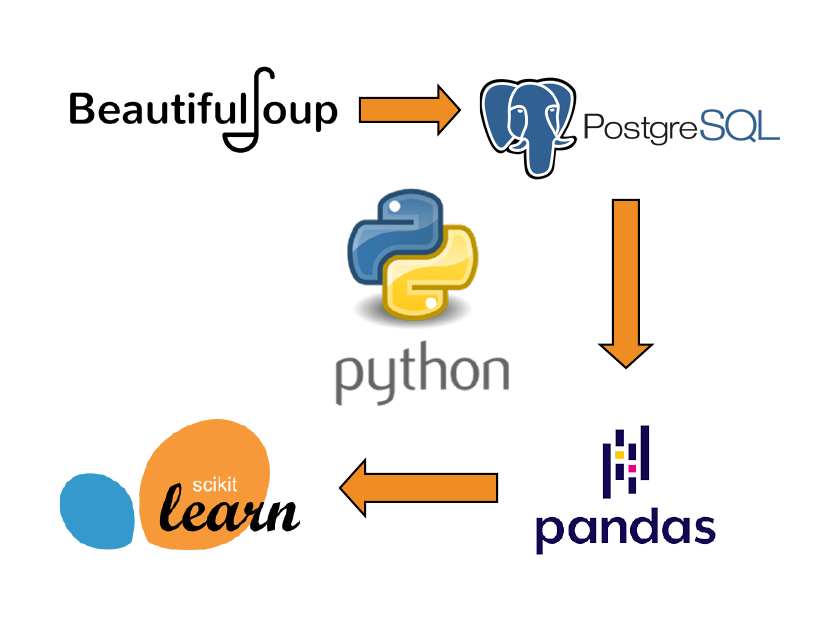
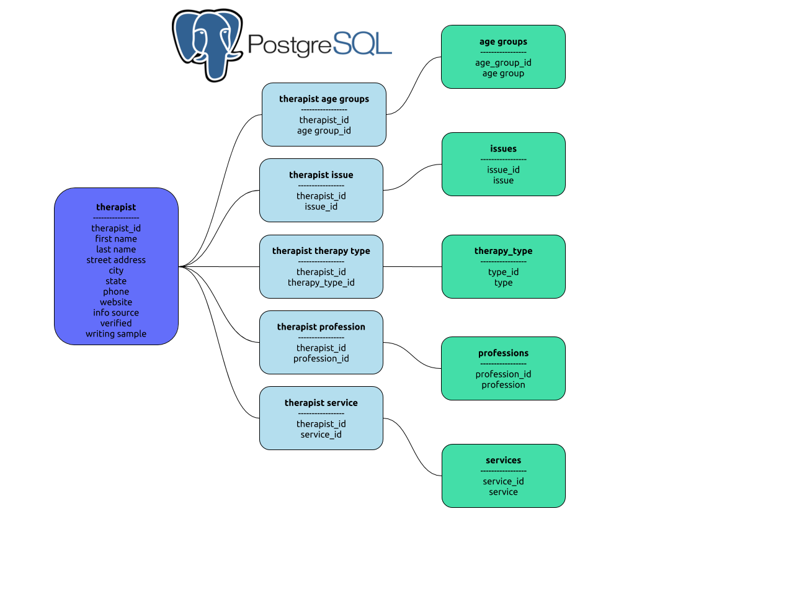
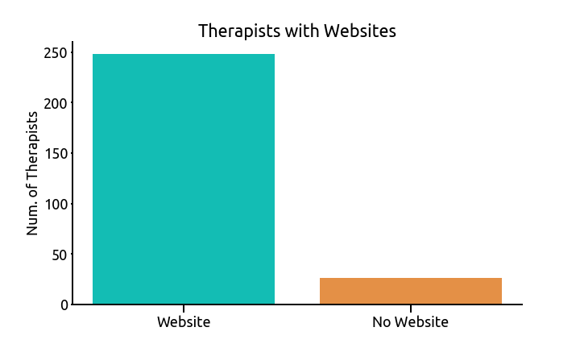
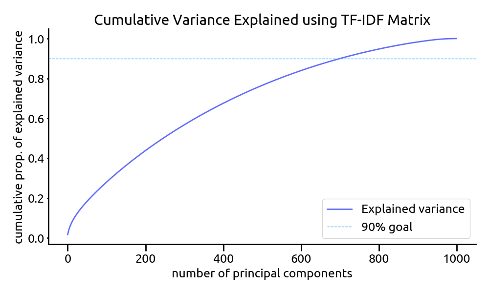
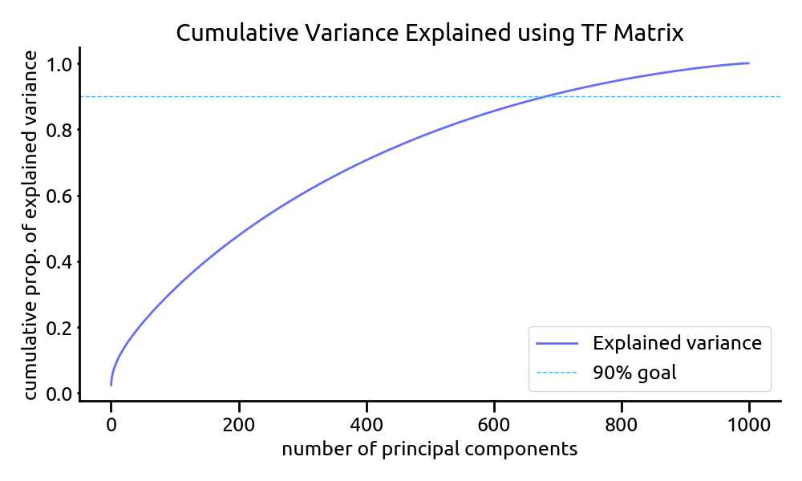
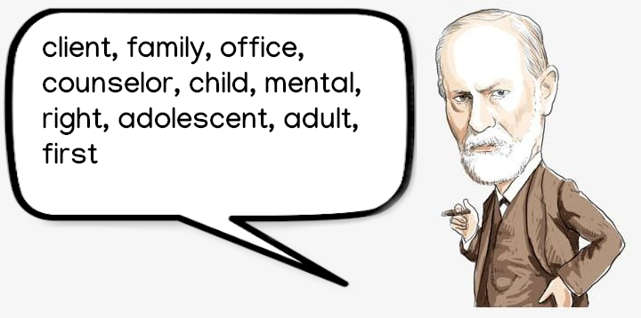

# NLP Analysis of Therapists' Profile Writing

## The Problem: 

People often are confused about how to choose a therapist. The best resource for a recommendation tends to be from a trusted family or friend. However, that is often not available or the person doesn't feel comfortable letting others know they are seeking therapy. So where to go? 

The most popular place is probably an on-line therapist directory such as those found at PsychologyToday.com and GoodTherapy.com.  **Searching for a therapist in a directory can be overwhelming as there are a lot of terms and jargon a person will encounter.**  Raise your hand if you know what Dialectical Behavioral Therapy is and if it would help you.

Plus there are so many options. According to the United States Department of Labor's Bureau of Labor Statistics, there are over **552,000 mental health professionals** practicing in the U.S. today whose main focus is the treatment (and/or diagnosis) of mental health or substance abuse concerns.

In **Denver**, there are **1,912 therapists** listed on PsychologyToday.com's therapist directory

### The Ultimate Goal: 

Create a machine learning model that matches a client to a therapist based on NLP analysis of a writing sample from each party.

### Capstone 1 Goals:

- Create a dataset of therapist writing samples from therapist profiles found from publicly available data on GoodTherapy.com
- Perform topic modeling on writing samples of Greater Denver Area therapists to see what themes cluster therapists together base on what words they use to describe their practice.
- Therapists often group around their **therapeutic orientation**, which is the primary psychological theory that guides their work. I will explore how the topics generates align with the traditional orientations.

## The Data

I obtained profile data for **273** therapists from GoodTherapy.com. 

### Sample Profile

##### Data Fields

Almost all of the data is categorical, many of which were lists.

| strings                      | text                                       | boolean          | int  |
| ---------------------------- | ------------------------------------------ | ---------------- | ---- |
| name                         | practice description (i.e. writing sample) | license verified |      |
| address                      |                                            |                  |      |
| phone                        |                                            |                  |      |
| license status               |                                            |                  |      |
| primary credential           |                                            |                  |      |
| website                      |                                            |                  |      |
| types of therapy **(list)**  |                                            |                  |      |
| issues treated **(list)**    |                                            |                  |      |
| services provided **(list)** |                                            |                  |      |
| age groups **(list)**        |                                            |                  |      |
| professions **(list)**       |                                            |                  |      |

### Workflow

### Database Design

PostgreSQL is "a general purpose and object-relational database management system, the most advanced open source database system" that implement structures query language (SQL).  PostgreSQL was developed in the Berkeley Computer Science Department at the University of California.

The database design was based of data available on GoodTherapy.org and PsychologyToday.com. Both had very similar data with some different naming conventions. 

## EDA

###### Most people seem to use about 200 words in their profile.

###### Here we see that there are far more possible options for issues and orientations and accordingly, these are the categories that have the most entries on therapist profiles. Might this be unhelpful to potential clients in that it could be overwhelming to understand what so many terms mean?

###### This one was a personal curiosity. When I first started my practice, I would estimate only about half of the therapists I knew had websites. I am glad more people are catching on to this inter-web craze.

## Looking for Structure with Principal Component Analysis

| With TFIDF Matrix                                        |                                                              |
| -------------------------------------------------------- | ------------------------------------------------------------ |
|  |  |

Here we see that there isn't a lot of structure with the TFIDF.

| With TF Matrix                                     |                                                        |
| -------------------------------------------------- | ------------------------------------------------------ |
|  |  |

Unfortunately, while things improve with the TF Matrix, the model still lacks solid structure.

## Latent Dirichlet Allocation Model (LDA)

#### Custom Stop Words list: 

change, find, approach, couples, issues, also, anxiety, working, relationship, relationships, therapist, counseling, people, feel, clients, help, work, therapy, psychotherapy, get, warson, counseling, way, practice, call, today, health, helping, free, depression, like, trauma, may, together, make, process, want, support, believe, goal, one, session, time, offer, individual, need, year, need, consultation, well, skill, new, emotional, provide, take, use, goal, person, individual,  many, healing, problem, see, know

##### Model perplexity: 878.052

Despite having quite a high perplexity score, some interesting topics emerged.

### Topic: Adult Relationships, Couples

### Topic: Mind-Body/Somatic

### Topic: Family and Children

